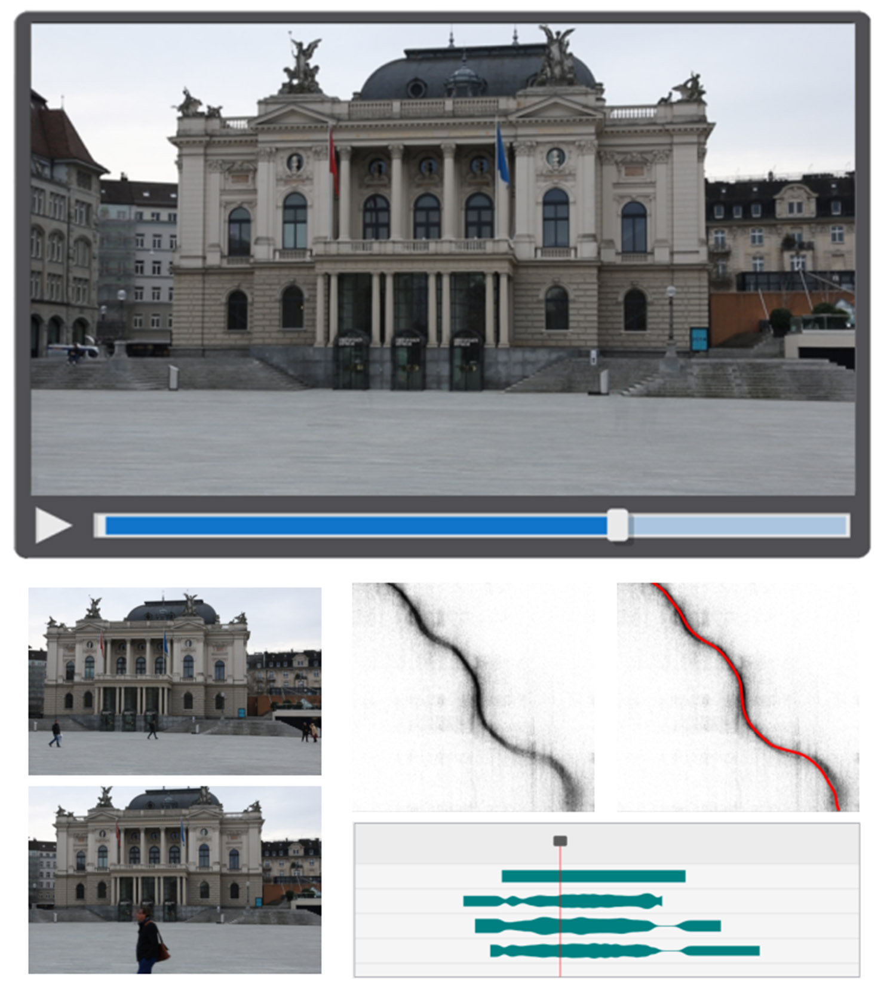

# VideoSnapping



Link to [Paper PDF](https://citeseerx.ist.psu.edu/viewdoc/download?doi=10.1.1.650.8437&rep=rep1&type=pdf)

Link to [Video](https://www.youtube.com/watch?v=iwT8Hs3rMug)

---

This repo contains a personal reimplementation of VideoSnapping: interactive synchronization of multiple videos.  Note that the implementation is missing *many aspects of the paper*, including:

- GUI components/interactivity.
- Warping constraints.
- Sub frame rendering.
- Global time parameterization.
- Multiple sequences.

In addition, it is also written for the purpose of clarity, and is unoptimized and **very slow**. All code provide here is to be used for research purposes only (please refer see the included license file). For questions regarding commercial use, including licensing rights and IP, you must contact the owner; The Walt Disney Company.

Note: If you use this software, please cite the original work:

```
@article{wang2014videosnapping,
  title={Videosnapping: Interactive synchronization of multiple videos},
  author={Wang, Oliver and Schroers, Christopher and Zimmer, Henning and Gross, Markus and Sorkine-Hornung, Alexander},
  journal={ACM Transactions on Graphics (TOG)},
  volume={33},
  number={4},
  pages={1--10},
  year={2014},
  publisher={ACM New York, NY, USA}
}
```

---

## Usage

Install requirements:
```
pip install -r requirements.txt
```

Align the included two demo sequences:
```
python videosnapping.py --vid1 data/vid1.mp4 --vid2 data/vid2.mp4 --fps 15 --partial-alignment
```

### Tips

If you are using `--partial_alignemnt`, and you get really short paths at the corner of the cost matrix, increase the `--min-steps` parameter.

Some sequences have more or fewer SIFT features detected in each frame. If you are getting bad results, try to look at the output path visualization. If you can not clearly see some structure in the cost matrix, try to modify the `--cm-sigma` parameter (for images with more matches (more texture), increase the value).

If it is too slow, reduce the `--fps`, parallelize the SIFT feature matching, or replace it with your choice of fast feature matcher. You may also want to restrict matching to a band near the diagonal if you know for example, that the videos are mostly aligned.
